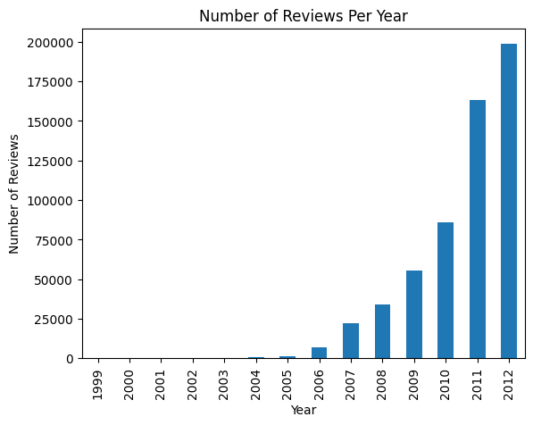

# Amazon Fine Food Reviews

This project applies Natural Language Processing (NLP) techniques to extract insights from food product reviews posted on Amazon. It's built using Python, Pandas, NLTK, and Matplotlib, and is designed as a showcase portfolio project.

---

## Project Goals:

- Clean and preprocess real-world customer review data
- Tokenize text data for further analysis
- Perform exploratory data analysis (EDA)
- Visualize word frequencies with WordCloud
- Conduct sentiment analysis
- Share business insights and recommendations

**Source**: [Amazon Fine Food Reviews](https://www.kaggle.com/datasets/snap/amazon-fine-food-reviews)  
**Records**: 568,000+ customer reviews  
**Key Features**:
- `Score` (rating 1–5)
- `Text` (the actual review)
- Additional metadata (not all used)

---

## 📊 Methods & Technologies

| Task               | Tools & Libraries Used                     |
|--------------------|--------------------------------------------|
| Data Loading       | pandas                                     |
| Text Preprocessing | nltk                                       |
| Visualization      | matplotlib, seaborn, wordcloud             |
| Sentiment Analysis | textblob or vader (coming soon)            |
| Classification     | scikit-learn (optional for future section) |

---

## Step 1: Data Preprocessing and Feature Engineering
In this step, we cleaned the dataset by removing null values, converting text to lowercase, and removing irrelevant columns like `ProductId` and `ProfileName`. 

### Data Cleaning Code:
df.dropna(inplace=True)

`df = df[['ProductId', 'UserId', 'Score', 'Time', 'Summary', 'Text', 
         'HelpfulnessNumerator', 'HelpfulnessDenominator']]`

`df['Text'] = df['Text'].str.lower()

df['Summary'] = df['Summary'].str.lower()`

Also we coverted the current UNIX timestamp in our dataset to datetime

`df['ReviewTime'] = pd.to_datetime(df['Time'], unit='s')`

### Creating Additional Features:
Additionally, we created new features that could help in understanding the reviews and their characteristics

`df['review_length'] = df['Text'].apply(lambda x: len(str(x).split()))`

`df['summary_length'] = df['Summary'].apply(lambda x: len(str(x).split()))`

`df['helpfulness_ratio'] = df['HelpfulnessNumerator'] / df['HelpfulnessDenominator'].replace(0, 1)`

`df['sentiment'] = df['Score'].apply(lambda x: 'positive' if x > 3 else ('negative' if x < 3 else 'neutral'))`

---

## Step 2: Tokenization
We tokenized the review text using NLTK and cleaned the tokens by removing stopwords.

`import nltk`

`nltk.download('punkt_tab')`

`df['tokens'] = df['Text'].apply(word_tokenize)`

`from nltk.corpus import stopwords`

`nltk.download('stopwords')`

`stop_words = set(stopwords.words('english'))`

`df['tokens_clean'] = df['tokens'].apply(lambda x: [word for word in x if word.lower() not in stop_words])`

`df[['tokens', 'tokens_clean']].head()`

After the tokenization had been implemented, we visulized the most frequent words in our review and noticed that symbols are chraters such as 'I', 'br' were prevalent. we took them out using the following code .

`import string`

`punctuation = set(string.punctuation)`

`df['tokens_clean'] = df['tokens'].apply(lambda x: [word for word in x if word.isalpha() and word not in stop_words])`

`df[['tokens', 'tokens_clean']].head()`

--- 

## Step 3: Sentiment Classification
We classified each review as positive, negative, or neutral based on the review score using a simple rule-based approach.

`df['sentiment'] = df['Score'].apply(lambda x: 'positive' if x > 3 else ('negative' if x < 3 else 'neutral'))`

`df['sentiment']`

---

## Step 4: Data Visualizations
In this step, we created various visualizations to explore the dataset and uncover patterns related to sentiment, review characteristics, and overall trends

1. Sentiment Distribution Based on Score : We visualized how the sentiment distribution varies across different review scores. This helps us understand if higher scores correlate with more positive sentiments or if negative sentiments can still appear in high-rated reviews

`import seaborn as sns`

`import matplotlib.pyplot as plt`

`sns.countplot(data=df, x='sentiment', order=['positive', 'neutral', 'negative'])`

`plt.title("Sentiment Distribution Based on Score")`

`plt.show()`

#### Insight
Based on the visualization, we can observe that most reviews with scores above 3 tend to be positive, while reviews with scores below 3 are largely negative. Neutral reviews are scattered around a score of 3, as expected.

---
2. Distribution of Review Lengths: We plotted the distribution of review lengths to explore if there’s any correlation between the length of the review and its sentiment or helpfulness.

`sns.histplot(df['review_length'], bins=50)`

`plt.title("Distribution of Review Lengths")`

`plt.show()`

#### Insight
The analysis shows that shorter reviews have a higher count, which suggests that users tend to write shorter reviews more frequently. However, as the review length increases, the number of reviews decreases.

---
3. Helpfulness Ratio by Sentiment: This visualization highlights the helpfulness ratio for each sentiment category. We wanted to explore if helpful reviews are more likely to come from certain sentiment categories.

`sns.boxplot(data=df, x='sentiment', y='helpfulness_ratio')`

`plt.title("Helpfulness Ratio by Sentiment")`

`plt.ylim(0, 1)`

`plt.show()`

#### Insight
Positive reviews tend to have a higher helpfulness ratio compared to negative reviews. This indicates that users often find positive reviews more useful.

---
4. Time Series: Reviews Over Time: We created a time series plot to understand how the number of reviews changed over time. This can be useful for identifying trends, such as seasonal spikes or any unusual activity in review submissions.

`df['ReviewTime'].dt.year.value_counts().sort_index().plot(kind='bar')`

`plt.title("Number of Reviews Per Year")`

plt.xlabel("Year")

`plt.ylabel("Number of Reviews")`

`plt.show()`

#### Insight
There seems to be a consistent increase in the number of reviews over time, with a noticeable spike around certain periods. This could correspond to product launches, promotions, or other marketing activities.

---
5. Word Cloud for Full Review Text and Summary: We generated word clouds to visualize the most common words in the full review text and the summaries. This helps identify the key terms frequently mentioned by users.

`from wordcloud import WordCloud`

`text_words = " ".join(df['Text'].dropna().astype(str).tolist())`

`summary_words = " ".join(df['Summary'].dropna().astype(str).tolist())`

`plt.figure(figsize=(12, 6))`

`plt.subplot(1, 2, 1)`

`plt.imshow(WordCloud(max_words=100, background_color='white').generate(text_words))`

`plt.axis('off')`

`plt.title("Word Cloud for Full Review Text")`

`plt.subplot(1, 2, 2)`

`plt.imshow(WordCloud(max_words=100, background_color='white').generate(summary_words))`

`plt.axis('off')`

`plt.title("Word Cloud for Summary")`

`plt.show()`

#### Insight
The word clouds show that words like “good,” “love,”, “best”, “delicious” are common in positive reviews, while “bad” and “problem”, “epensive” appear frequently in negative reviews. The summaries often focus on key product features.

---
6. Top 20 Most Frequent Words in Reviews
We visualized the 20 most frequent words in the reviews, excluding stopwords and common punctuation. This highlights the most important keywords associated with customer experiences.

`from collections import Counter`

`import matplotlib.pyplot as plt`

`all_words = [word for tokens in df['tokens_clean'] for word in tokens]`

`word_freq = Counter(all_words)`

`common_words = word_freq.most_common(20)`

`words, counts = zip(*common_words)`

`plt.figure(figsize=(12,6))`

`plt.bar(words, counts)`

`plt.xticks(rotation=45)`

`plt.title("Top 20 Most Frequent Words in Reviews")`

`plt.show()`

#### Insight
The most frequent words tend to align with product attributes and customer satisfaction. Words related to quality, price, and performance dominate the most frequent list, which is useful for understanding what customers focus on when writing reviews.

---

## Step 5: Future Work
In future steps, I plan to build a text classifier using advanced techniques like TF-IDF with Logistic Regression or explore topic modeling to uncover hidden themes in the reviews.

---
## Conclusion
This project provides valuable insights into customer sentiment and the most frequent topics discussed in reviews. The next steps will involve refining the classification model and incorporating more advanced NLP techniques. Also, as the analysis progresses, we plan to build predictive models and topic modeling, to better understand customer feedback and enhance the recommender system.

---
#### License
This project is licensed under the MIT License.

